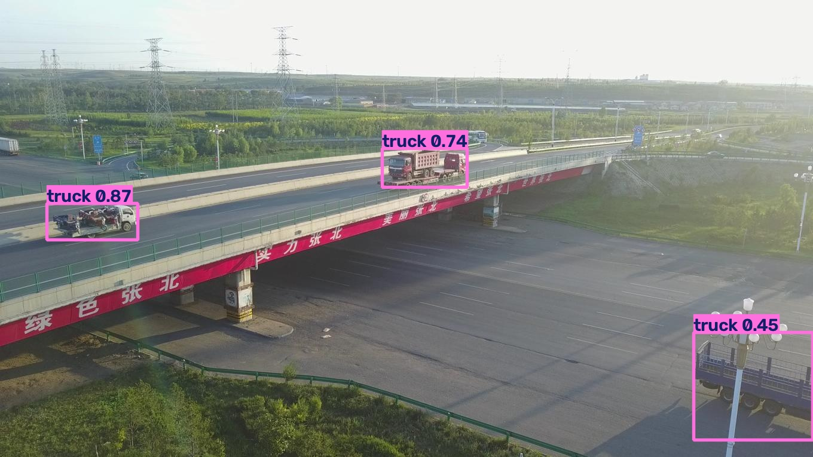
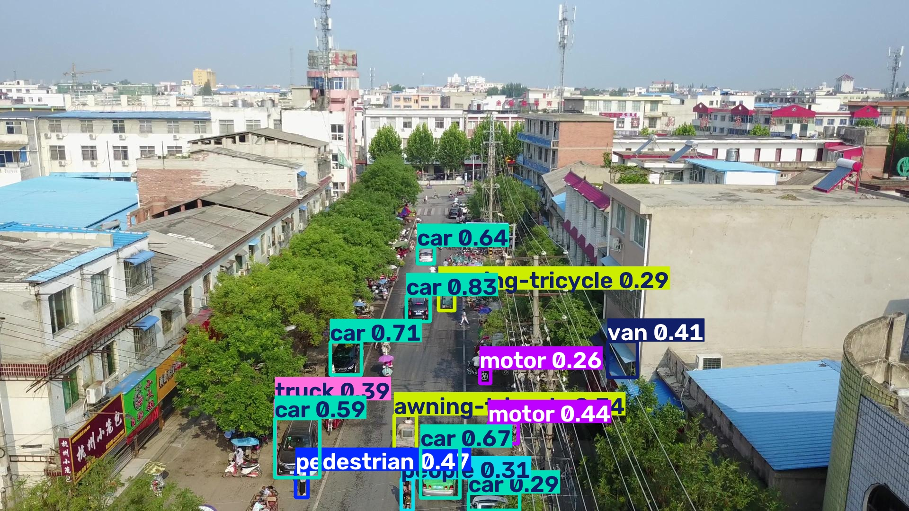

# Trainee Test

Датасет об'єктів на дрон-зйомці ([VisDrone2019-DET](https://github.com/VisDrone/VisDrone-Dataset));

Повний цикл від аналізу датасету EDA, до навчання попередньо натреновоної моделі YOLOv8n, далі оцінка натренованої моделі val/test та розбір конкретних прикладів error analysis.

## Навіщо саме VisDrone

Тематика близька до GIS / аеро: місто з висоти, дрібні об'єкти, щільні сцени.  
Питання дослідження: *наскільки nano-модель тягне small objects з дрона і де сипиться?*

## Показники

- val: mAP50 - 0.30; Precision - 0.43; Recall - 0.33
- test: mAP50 - 0.26; Precision - 0.39; Recall - 0.29


- Найкращі: `car`, `bus` (великі, багато прикладів у датасеті)
- Найгірше: `bicycle`, `people`, `awning-tricycle` - рідкісні класи, дрібні bbox

Тренування: 80 епох, `batch=8`, `imgsz=640`, RTX 4050 6 GB на 2.5 год

## Приклади predict

**Good** — нещільні сцени, великі об'єкти:



**Bad** — натовп / далекі дрібні об'єкти:



### Спостереження після інференсу

На одному з good прикладів повторний `predict` знайшов більше об'єктів, ніж було помічено дивлячись на картинку.  
Це показує і сильну сторону детектора.

## Нотбуки

`notebooks/Trainee_2.ipynb` - датасет та EDA
`notebooks/Trainee_3.ipynb` - тренування, метрики
`notebooks/Trainee_4.ipynb` - test, good/bad, error analysis
`notebooks/Trainee_5.ipynb` - висновки 

## Запуск

```bash
python -m venv .venv

.\.venv\Scripts\Activate.ps1

pip install -r requirements.txt
